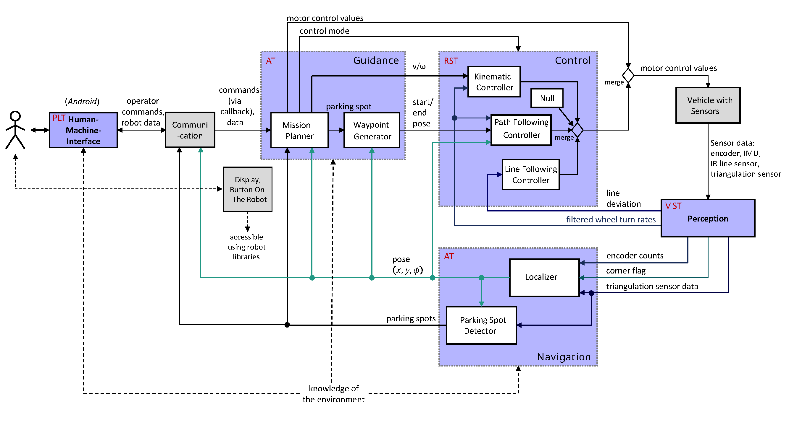
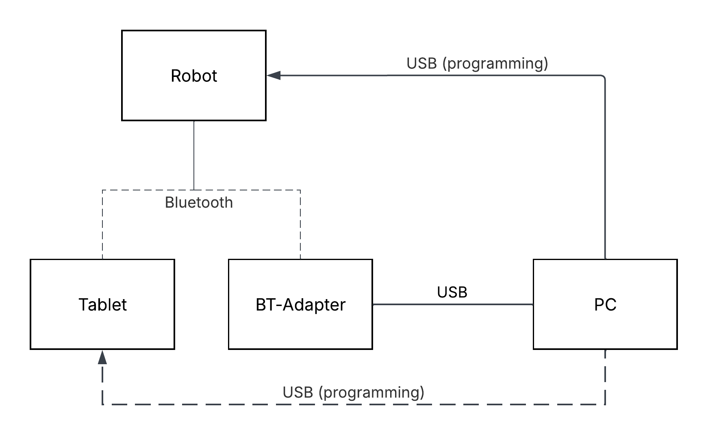

# Line Guided Autonomous Parking Robot


## Overview
This project comprises multiple modules in order to achieve a functioning robot car that is able to navigate in a controlled manner as desired by the user.
Developed as part of the [main seminar in automation and control technology](https://tu-dresden.de/ing/elektrotechnik/ifa/plt/studium/lehrveranstaltungen/hauptseminar-amr) at TU Dresden.

## Key Features
The robot is able to

- follow a path traced out by a line.
- scan for parking spots and park in them.
- get out of a parking spot when parked.

Furthermore it can be controlled by means of an android application with a graphical user interface.

## System Architecture


The system consists of 5 modules that work together to realize the key features listed above.

1. Guidance
2. Perception
3. Navigation
4. HMI
5. Control **(my work)**

## Results
You may view a video of the robot in action on YouTube soon.

## Hardware


## Getting Started
### Prerequisites

- Python 3.10+
- Pololu 3pi+ 2040 (including Bluetooth adapter for PC)
- Optional: Android tablet for deployment of the HMI application

**Important notice**

### Installation

To install, please open the console in a directory of your choice and run the following commands.
```bash
git clone https://github.com/felix-alr/line-guided-autonomous-parking-robot.git
cd line-guided-autonomous-parking-robot
```
Alternatively, you can download the project files right here on GitHub by clicking ```Code > Download ZIP``` and unpacking the file in your working directory.

### Setup
To flash the project onto your Pololu 3pi+ 2040, please ensure that ```mpremote```is installed using ```mpremote --version``` or install it using ```pip install mpremote```.
Once installed, you can continue flashing while in the ```robot_src``` directory.

#### Flashing On Windows
To flash on Windows, please run the download.bat file within the ```robot_src``` directory.
The batch file will then load all project files onto your Pololu 3pi+ 2040.

#### Flashing On Linux

On Linux you may open the terminal in the ```robot_src``` directory and run the following command.

```bash
mpremote connect [device] cp -r . :
```

#### Deploying Android Application

In order to deploy the application on an Android tablet using Android Studio, open the project located within ```hmi_src``` in Android Studio and follow the instructions on the official [Android website](https://developer.android.com/studio/run/device).

### Running the program

After flashing, you may reset the robot using its reset button. You can then connect to the robot via Blutooth on your PC using a Blutooth adapter and the Visual Studio Code console to send commands or alternatively using an android tablet with the HMI software which is located within ```hmi_src```.
What follows is a list of commands that can be sent via Bluetooth in order to switch modes.

- ```z``` &mdash; idle mode: robot does nothing.
- ```r``` &mdash; setup mode: needs to be called first.
- ```y``` &mdash; scout mode: lets the robot drive around the parkour to scout for parking spots.
- ```1``` &mdash; makes the robot send over the current pose of the robot.
- ```2``` &mdash; makes the robot send over the parking spots it detected.
- ```3 #index``` &mdash; tells the robot to start parking in the parking spot at index ```#index``` in the list returned by ```2```.
- ```4``` &mdash; allows you to send the robot target positions for the position controller.
- ```q``` &mdash; external mode: allows you to control the robots speed manually using ```w``` increase, ```s``` to decrease forward speed and ```a``` to increase (left turn), ```d``` to decrease (right turn) angular speed.
